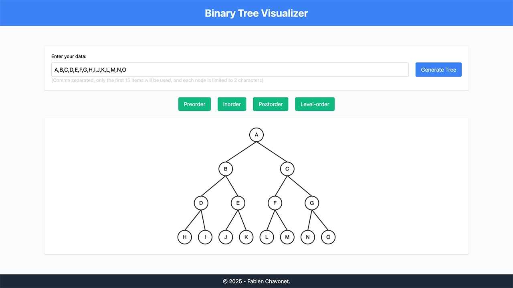

# Binary Tree Visualizer

## Description

This project is a visual learning tool designed to help students understand binary trees, particularly the different traversal types (preorder, inorder, postorder, and level-order).

I created this tool to provide an easy-to-use visual representation that illustrates how binary trees are structured and how traversals work.

Although not perfect, it effectively serves its educational purpose.

## Objectives

- Help students grasp the concepts behind binary trees.
- Visually demonstrate various tree traversal methods.
- Provide an interactive and easy-to-use interface.
- Serve as a practical educational aid in computer science courses.

## Tech Stack


## File Description

| **FILE**     | **DESCRIPTION**                                     |
| :----------: | --------------------------------------------------- |
| `assets`     | Contains the resources required for the repository. |
| `index.html` | Main HTML structure for the project.                |
| `script.js`  | Behavior script for interactivity.                  |
| `README.md`  | The README file you are currently reading 😉.       |

## Installation & Usage

### Installation

1. Clone this repository:
    - Open your preferred Terminal.
    - Navigate to the directory where you want to clone the repository.
    - Run the following command:

```
git clone https://github.com/fchavonet/full_stack-binary_tree_visualizer.git
```

2. Open the cloned repository.

### Usage

1. Open the `index.html` file in your web browser.

2. Enter comma-separated values in the input field (only the first 15 will be used, and each node label is limited to 2 characters).

3. Click on "Generate Tree" to visualize the binary tree.

4. Use the traversal buttons (Preorder, Inorder, Postorder, Level-order) to see the tree traversal animations.

You can also test the project online by clicking [here](https://fchavonet.github.io/full_stack-binary_tree_visualizer/).

<p align="center">
    
</p>

## What's Next?

- Add responsive design support.
- Improve the overall user interface and visuals.

## Thanks

- A big thank you to my friends Pierre and Yoann, always available to test and provide feedback on my projects.

## Author(s)

**Fabien CHAVONET**
- GitHub: [@fchavonet](https://github.com/fchavonet)
